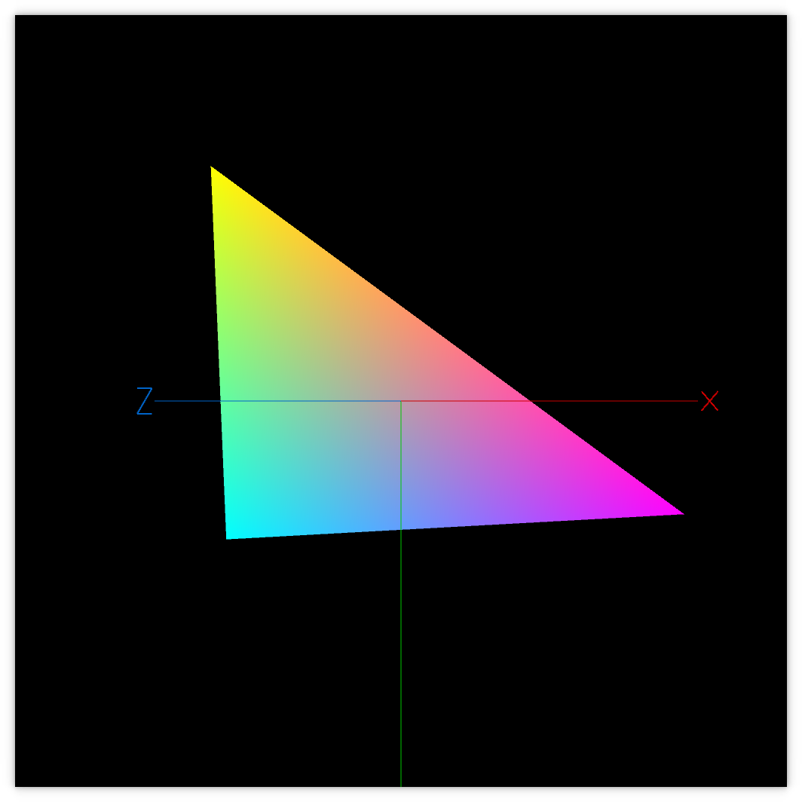

<section id="themes">
	<h2>Themes</h2>
		<p>
			Set your presentation theme: <br>
			<!-- Hacks to swap themes after the page has loaded. Not flexible and only intended for the reveal.js demo deck. -->
                        <a href="#" onclick="document.getElementById('theme').setAttribute('href','css/theme/black.css'); return false;">Black (default)</a> -
			<a href="#" onclick="document.getElementById('theme').setAttribute('href','css/theme/white.css'); return false;">White</a> -
			<a href="#" onclick="document.getElementById('theme').setAttribute('href','css/theme/league.css'); return false;">League</a> -
			<a href="#" onclick="document.getElementById('theme').setAttribute('href','css/theme/sky.css'); return false;">Sky</a> -
			<a href="#" onclick="document.getElementById('theme').setAttribute('href','css/theme/beige.css'); return false;">Beige</a> -
			<a href="#" onclick="document.getElementById('theme').setAttribute('href','css/theme/simple.css'); return false;">Simple</a> <br>
			<a href="#" onclick="document.getElementById('theme').setAttribute('href','css/theme/serif.css'); return false;">Serif</a> -
			<a href="#" onclick="document.getElementById('theme').setAttribute('href','css/theme/blood.css'); return false;">Blood</a> -
			<a href="#" onclick="document.getElementById('theme').setAttribute('href','css/theme/night.css'); return false;">Night</a> -
			<a href="#" onclick="document.getElementById('theme').setAttribute('href','css/theme/moon.css'); return false;">Moon</a> -
			<a href="#" onclick="document.getElementById('theme').setAttribute('href','css/theme/solarized.css'); return false;">Solarized</a>
		</p>
</section>

H:

## VERTEX-SHADERS IN PROCESSING

Jean Pierre Charalambos

H:

## Contents

1. Introduction
2. Shader design patterns
3. Lighting intro
4. Diffuse light
5. Specular light

H:

## Intro: What is a shader?

<li class="fragment">A shader is a program that runs on the GPU (Graphics Processing Unit) and it is controlled by our application (for example a Processing sketch)</li>
<li class="fragment">The language of the shaders in Processing is GLSL (OpenGL Shading Language)</li>

### History

<li class="fragment">Andres Colubri started his involvement with Processing back in 2007 with a couple of libraries called <a href="http://andrescolubri.net/glgraphics_gsvideo/" target="_blank">GLGraphics and GSVideo</a></li>
<li class="fragment">In 2013, <a href="http://andrescolubri.net/processing-2/" target="_blank">Processing 2.0</a> was released and incorporated most of the funcionality of GLGraphics and GSVideo, including shaders, into the core of the language</li>

V:

## Intro: The graphics pipeline

<div class="ulist">
    
    <ul style="width: 30%;">
        <p class="fragment" data-fragment-index="1">Vertex shader</p>
        <p class="fragment" data-fragment-index="2">Fragment shader</p>
    </ul>
</div>

V:

## Intro: Shaders GPU execution

The vertex shader is run on *each vertex* sent from the sketch:

```python
for vertex in geometry:
    vertex_clipspace = vertex_shader(vertex)
```

The fragment shader is run on *each pixel* covered by the geometry in our sketch:

```python
for pixel in screen:
    if covered_by_geometry(pixel):
        ouptut_color = fragment_shader(pixel)
```

V:

## Intro: Shader variable types

<li class="fragment">*Uniform* variables are those that remain constant for each vertex in the scene, for example the _projection_ and _modelview_ matrices</li>
<li class="fragment">*Attribute* variables are defined per each vertex, for example the _position_, _normal_, and _color_</li>
<li class="fragment">*Varying* variables allows to relate a vertex attribute to a fragment, using interpolation</li>

N:

* varying variables get interpolated between the vertex and the fragment shader

V:

## Intro: Processing shader API: [PShader](https://processing.org/reference/PShader.html)

> Class that encapsulates a GLSL shader program, including a vertex and a fragment shader

V:

## Intro: Processing shader API: [loadShader()](https://processing.org/reference/loadShader_.html)

> Loads a shader into the PShader object

Method signatures

```processing
  loadShader(fragFilename)
  loadShader(fragFilename, vertFilename)
```
<!-- .element: class="fragment" data-fragment-index="1"-->

Example

```processing
  PShader unalShader;
  void setup() {
    ...
    //when no path is specified it looks in the sketch 'data' folder
    unalShader = loadShader("unal_frag.glsl", "unal_vert.glsl");
  }
```
<!-- .element: class="fragment" data-fragment-index="2"-->

V:

## Intro: Processing shader API: [shader()](https://processing.org/reference/shader_.html)

> Applies the specified shader

Method signature

```processing
  shader(shader)
```
<!-- .element: class="fragment" data-fragment-index="1"-->

Example

```processing
  PShader simpleShader, unalShader;
  void draw() {
    ...
    shader(simpleShader);
    simpleGeometry();
    shader(unalShader);
    unalGeometry();
  }
```
<!-- .element: class="fragment" data-fragment-index="2"-->

V:

## Intro: Processing shader API: [resetShader()](https://processing.org/reference/resetShader_.html)

> Restores the default shaders

Method signatures

```processing
  resetShader()
```
<!-- .element: class="fragment" data-fragment-index="1"-->

Example

```processing
  PShader simpleShader;
  void draw() {
    ...
    shader(simpleShader);
    simpleGeometry();
    resetshader();
    otherGeometry();
  }
```
<!-- .element: class="fragment" data-fragment-index="2"-->

V:

## Intro: Processing shader API: [PShader.set()](https://processing.org/reference/PShader_set_.html)

> Sets the uniform variables inside the shader to modify the effect while the program is running

Method signatures for vector uniform variables [vec2, vec3 or vec4](https://www.khronos.org/opengl/wiki/Data_Type_%28GLSL%29#Vectors):

```processing
  .set(name, x)
  .set(name, x, y)
  .set(name, x, y, z)
  .set(name, x, y, z, w)
  .set(name, vec)
```

* *name*: of the uniform variable to modify
* *x*, *y*, *z* and *w*: 1st, snd, 3rd and 4rd vec float components resp.
* *vec*: PVector

V:

## Intro: Processing shader API: [PShader.set()](https://processing.org/reference/PShader_set_.html)

> Sets the uniform variables inside the shader to modify the effect while the program is running

Method signatures for array uniform variables [bool[], float[], int[]](https://www.khronos.org/opengl/wiki/Data_Type_%28GLSL%29#Arrays):

```processing
  .set(name, x)
  .set(name, x, y)
  .set(name, x, y, z)
  .set(name, x, y, z, w)
  .set(name, vec)
```

* *name*: of the uniform variable to modify
* *x*, *y*, *z* and *w*: 1st, snd, 3rd and 4rd vec (boolean, float or int) components resp.
* *vec*: boolean[], float[], int[]

V:

## Intro: Processing shader API: [PShader.set()](https://processing.org/reference/PShader_set_.html)

> Sets the uniform variables inside the shader to modify the effect while the program is running

Method signatures for [mat3 and mat4](https://www.khronos.org/opengl/wiki/Data_Type_%28GLSL%29#Matrices) uniform variables:

```processing
  .set(name, mat) // mat is PMatrix2D, or PMatrix3D
```

* *name* of the uniform variable to modify
* *mat* PMatrix3D, or PMatrix2D

V:

## Intro: Shaders
### Processing shader API: [PShader.set()](https://processing.org/reference/PShader_set_.html)

> Sets the uniform variables inside the shader to modify the effect while the program is running

Method signatures for _texture_ uniform variables:

```processing
  .set(name, tex) // tex is a PImage
```

V:

## Intro: Processing shader API: [PShader.set()](https://processing.org/reference/PShader_set_.html)

> Sets the uniform variables inside the shader to modify the effect while the program is running

Example to set `mat4` uniform variables:

```processing
  PShader unalShader;
  PMatrix3D projectionModelView1, projectionModelView2;
  void draw() {
    ...
    shader(unalShader);
    unalShader.set("unalMatrix", projectionModelView1);
    unalGeometry1();
    unalShader.set("unalMatrix", projectionModelView2);
    unalGeometry2();
  }
```
<!-- .element: class="fragment" data-fragment-index="1"-->

H:

## Shader design patterns

1. Data sent from the sketch to the shaders<!-- .element: class="fragment" data-fragment-index="1"-->
2. Passing data among shaders<!-- .element: class="fragment" data-fragment-index="2"-->
3. Consistency of geometry operations<!-- .element: class="fragment" data-fragment-index="3"-->

V:

## Shader design patterns
### Pattern 1: Data sent from the sketch to the shaders

> Processing passes data to the shaders in a context sensitive way

<li class="fragment">Specific data (attribute and uniform vars) sent to the GPU depends on the specific Processing commands issued, e.g., ```fill(rgb) -> attribute vec4 color```
<li class="fragment">Several types of shader thus arise in Processing
<li class="fragment">More details are discussed in the _Shader Programming for Computational Arts and Design - A Comparison between Creative Coding Frameworks_ [paper](http://www.scitepress.org/DigitalLibrary/PublicationsDetail.aspx?ID=ysaclbloDHk=&t=1)

V:

## Shader design patterns
### Pattern 1: Data sent from the sketch to the shaders
#### (Frequently used) Attribute variables

| Processing methods    | Type   | Attribute                | Space     |
|-----------------------|:------:|:------------------------:|:---------:|
| `vertex()`            | `vec4` | `vertex` (or `position`) | _local_   |
| `normal()`, `shape()` | `vec3` | `normal`                 | _local_   |
| `vertex()`            | `vec2` | `texCoord`               | _texture_ |
| `stroke()`, `fill()`  | `vec4` | `color`                  | --        |

V:

## Shader design patterns
### Pattern 1: Data sent from the sketch to the shaders
#### (Frequently used) Uniform variables

| Processing methods                                                    | Type        | Uniform         |
|-----------------------------------------------------------------------|:-----------:|:---------------:|
| `orhto()`, `perspective()`                                            | `mat4`      | `projection`    |
| `applyMatrix()`, `translate()`,<br>  `rotate()`, `scale()`            | `mat4`      | `modelview`     |
| `applyMatrix()`, `translate()`,<br>  `rotate()`, `scale()`            | `mat3`      | `normalMatrix`  |

V:

## Shader design patterns
### Pattern 1: Data sent from the sketch to the shaders
#### (Frequently used) Uniform variables

| Processing methods                                                    | Type        | Uniform         | Space     |
|-----------------------------------------------------------------------|:-----------:|:---------------:|:---------:|
| `texture()`                                                           | `mat4`      | `texMatrix`     | --        |
| `texture()`                                                           | `sampler2D` | `texture`       | --        |
| `texture()`                                                           | `vec2`      | `texOffset`     | _texture_ |
| `lights()`, `ambientLight()`,<br> `spotLight()`, `directionalLight()` | `vec4`      | `lightPosition` | _eye_     |

V:

## Shader design patterns
### Pattern 1: Data sent from the sketch to the shaders

> Check the [code](https://github.com/processing/processing/tree/master/core/src/processing/opengl/shaders) to consult all the attribute and uniform variables sent to the shaders

V:

## Shader design patterns
### Pattern 2: Passing data among shaders

> Uniform variables are available for both, the vertex and the fragment shader. Attribute variables are only available to the vertex shader

<li class="fragment"> Passing a vertex *attribute* variable to the fragment shader thus requires relating it first to a vertex shader *varying* variable
<li class="fragment"> The vertex and fragment shaders would look like the following:
  ```glsl
  // vert.glsl
  attribute <type> var;
  varying <type> vert_var;
  void main() {
    ...
    vert_var = fx(var);
  }
  ```
  ```glsl
  // frag.glsl
  varying <type> vert_var;
  ```

V:

## Shader design patterns
### Pattern 2: Passing data among shaders
#### (Frequently used) Varying variables

| Processing methods    | Type   | Attribute  | Type   | Varying        |
|-----------------------|:------:|:----------:|:-------|:--------------:|
| `stroke()`, `fill()`  | `vec4` | `color`    | `vec4` | `vertColor`    |
| `vertex()`            | `vec2` | `texCoord` | `vec4` | `vertTexCoord` |

V:

## Shader design patterns
### Pattern 3: Consistency of geometry operations

> Geometry operation operands should be defined in the same coordinate system

<li class="fragment"> Tip 1: ```transform * vertex // projection * modelview * vertex``` yields the vertex coordinates in [clip-space](http://www.songho.ca/opengl/gl_transform.html)
<li class="fragment"> Tip 2: ```modelview * vertex``` yields the vertex coordinates in eye-space
<li class="fragment"> Tip 3: Since the eye position is 0 in eye-space, eye-space is the usual coordinate system for geometry operations

H:

## Examples
### Raster

<figure>
    
    <figcaption>[Raster example](https://github.com/VisualComputing/Shaders/tree/gh-pages/sketches/desktop/raster)</figcaption>
</figure>

V:

## Examples
### Raster

[Vertex shader code:](https://github.com/VisualComputing/Shaders/blob/gh-pages/sketches/desktop/raster/data/vert.glsl)

```glsl
// Pattern 1: variables are sent by processing
uniform mat4 transform;
attribute vec4 position;
attribute vec4 color;
varying vec4 vertColor;

void main() {
  // Pattern 2: data among shaders
  vertColor = color;
  // Patter 3: consistency of geometry operations
  // gl_Position should be defined in clipspace
  gl_Position = transform * position;
}
```

V:

## Examples
### Raster

[Fragment shader code:](https://github.com/VisualComputing/Shaders/blob/gh-pages/sketches/desktop/raster/data/frag.glsl)

```glsl
varying vec4 vertColor;
uniform bool cmy;

void main() {
  gl_FragColor = cmy ? vec4(1-vertColor.r, 1-vertColor.g, 1-vertColor.b, vertColor.a) : vertColor;
}
```

V:

## Examples
### Raster

[raster.pde excerpt:](https://github.com/VisualComputing/Shaders/blob/gh-pages/sketches/desktop/raster/raster.pde)

```java
PShader shader;
boolean cmy;

void setup() {
  //shader = loadShader("frag.glsl", "vert.glsl");
  // same as:
  shader = loadShader("frag.glsl");
  // don't forget to ask why?
  shader(shader);
}

void draw() {
  background(0);
  scene.drawAxes();
  scene.render();
}

void keyPressed() {
  if (key == 'c') {
    cmy = !cmy;
    shader.set("cmy", cmy);
  }
}
```

V:

## Examples
### Bypassing Processing matrices

<figure>
    
    <figcaption>Passive transformation shaders output (source code available [here](https://github.com/VisualComputing/Shaders/tree/gh-pages/sketches/desktop/PassiveTransformations))</figcaption>
</figure>

V:

## Examples
### Bypassing Processing matrices
#### Design patterns

> Pattern 1: Data sent from the sketch to the shaders

([vert.glsl](https://github.com/VisualComputing/Shaders/blob/gh-pages/sketches/desktop/PassiveTransformations/data/vert.glsl) excerpt)

```glsl
...
uniform mat4 nub_transform;
attribute vec4 vertex;

void main() {
  gl_Position = nub_transform * vertex;
  ...
}
```

V:

## Examples
### Bypassing Processing matrices
#### Design patterns

([PassiveTransformations.pde](https://github.com/VisualComputing/Shaders/blob/gh-pages/sketches/desktop/PassiveTransformations/data/vert.glsl) excerpt)

```java
Graph graph;
Node[] nodes;
PShader shader;

void setup() {
  graph = new Graph(g, width, height);
  graph.setMatrixHandler(new MatrixHandler() {
    @Override
    protected void _setUniforms() {
      shader(shader);
      Scene.setUniform(shader, "nub_transform", transform());
    }
  });
  ...
  //discard Processing matrices
  resetMatrix();
  shader = loadShader("frag.glsl", "vert.glsl");
}

void draw() {
  background(0);
  // sets up the initial nub matrices according to user interaction
  graph.preDraw();
  graph.render();
}
```

H:

## Light shaders
### Simple lighting models

Simple lighting models of a 3D scene involves at least:

1. (optionally) Taking into account ambient light
2. Placing one or more light sources in the space
3. Defining their parameters, such as type (point, spotlight) and color (diffuse, specular)

Assumption: light source that light equally in all directions
<!-- .element: class="fragment" data-fragment-index="1"-->

H:

## Light shaders: diffuse light
### Lighting parameters

<figure>
    
    <figcaption>Diffuse light: `$I = direction \bullet normal$`</figcaption>
</figure>

V:

## Light shaders: diffuse light
### Per-Vertex vs Per-Fragment computations

<figure>
    
    <figcaption>Diffuse light: `$I = direction \bullet normal$`</figcaption>
</figure>

V:

## Light shaders: diffuse light
### Per-Vertex computations

<figure>
    
    <figcaption>Per vertex diffuse light shader output (source code available [here](https://github.com/codeanticode/pshader-tutorials/blob/master/intro/Ex_06_1_light/))</figcaption>
</figure>

V:

## Light shaders: per-vertex diffuse light
### Design patterns

> Pattern 1: Data sent from the sketch to the shaders

```glsl
//excerpt from lightvert.glsl
uniform mat4 modelview;
uniform mat3 normalMatrix;
uniform vec4 lightPosition;

attribute vec4 position;
attribute vec4 color;
attribute vec3 normal;
```

V:

## Light shaders: per-vertex diffuse light
### Design patterns
#### Observation about the [normal matrix](http://www.lighthouse3d.com/tutorials/glsl-12-tutorial/the-normal-matrix/)

Let $M$ be $ModelView(4;4)$ (i.e., it is formed by deleting row and column 4 from the ModelView)

> Multiplying the input ```normal``` vector by the ```normalMatrix```, i.e., `$({M^{-1})}^T$`, yields its coordinates in the eye-space

V:

## Light shaders: per-vertex diffuse light
### Design patterns
#### Observation about the [normal matrix](http://www.lighthouse3d.com/tutorials/glsl-12-tutorial/the-normal-matrix/)

Why not use ```modelview``` matrix, instead of ```normalMatrix``` (`$({M^{-1})}^T$`)?

<figure>
    
    <figcaption>`$N * modelview$` when the matrix contains a non-uniform scale</figcaption>
</figure>
<!-- .element: class="fragment" data-fragment-index="1"-->

V:

## Light shaders: per-vertex diffuse light
### Design patterns

> Pattern 2: Passing data among shaders

> Pattern 3: Consistency of geometry operations

```glsl
//excerpt from lightvert.glsl
uniform vec4 lightPosition;
varying vec4 vertColor;

void main() {
  ...
  vec3 ecPosition = vec3(modelview * position);//eye coordinate system
  vec3 ecNormal = normalize(normalMatrix * normal);//eye coordinate system
  vec3 direction = normalize(lightPosition.xyz - ecPosition);//Pattern 3   
  float intensity = max(0.0, dot(direction, ecNormal));//Pattern 3
  vertColor = vec4(intensity, intensity, intensity, 1) * color;
}
```

V:

## Light shaders: per-vertex diffuse light
### Design patterns

> Pattern 2: Passing data among shaders

```glsl
//lightfrag.glsl
varying vec4 vertColor;

void main() {
  gl_FragColor = vertColor;
}
```

V:

## Light shaders: per-vertex diffuse light
### Design patterns

<figure>
    
    <figcaption>Per pixel diffuse light shader output (source code available [here](https://github.com/codeanticode/pshader-tutorials/blob/master/intro/Ex_06_2_pixlight/))</figcaption>
</figure>

V:

## Light shaders: per-vertex diffuse light
### Design patterns

> Pattern 1: Data sent from the sketch to the shaders

```glsl
//excerpt from pixlightvert.glsl
uniform mat4 modelview;
uniform mat3 normalMatrix;
uniform vec4 lightPosition;

attribute vec4 position;
attribute vec4 color;
attribute vec3 normal;
```

V:

## Light shaders: per-vertex diffuse light
### Design patterns

> Pattern 2: Passing data among shaders

> Pattern 3: Consistency of geometry operations

```glsl
//excerpt from pixlightvert.glsl
varying vec4 vertColor;
varying vec3 ecNormal;
varying vec3 lightDir;

void main() {
  ...
  vec3 ecPosition = vec3(modelview * position);
  ecNormal = normalize(normalMatrix * normal);
  lightDir = normalize(lightPosition.xyz - ecPosition);//Pattern 3
  vertColor = color;
}
```

V:

## Light shaders: per-vertex diffuse light
### Design patterns

> Pattern 2: Passing data among shaders

> Pattern 3: Consistency of geometry operations

```glsl
//pixlightfrag.glsl
varying vec4 vertColor;
varying vec3 ecNormal;
varying vec3 lightDir;

void main() {  
  vec3 direction = normalize(lightDir);
  vec3 normal = normalize(ecNormal);
  float intensity = max(0.0, dot(direction, normal));//Pattern 3
  gl_FragColor = vec4(intensity, intensity, intensity, 1) * vertColor;
}
```

H:

## Light shaders: specular light ([Phong model](https://en.wikipedia.org/wiki/Phong_reflection_model))
### Lighting parameters

<figure>
    
    <figcaption>Specular light: `$I = direction_{reflected} \bullet observer$`</figcaption>
</figure>

V:

## Light shaders: specular light
### Per-Vertex vs Per-Fragment computations

<figure>
    
    <figcaption>Specular light: `$I = direction_{reflected} \bullet observer$`</figcaption>
</figure>

V:

## Light shaders: specular light
### Per-Vertex computations

<figure>
    
    <figcaption>Per vertex specular light shader output (source code available [here](https://github.com/VisualComputing/Shaders/tree/gh-pages/sketches/desktop/Specular))</figcaption>
</figure>

V:

## Light shaders: per-vertex specular light
### Design patterns

> Identifying the per vertex specular shader design patterns is left as an excercise to the reader

V:

## Light shaders: per-pixel specular light
### Design patterns

<figure>
    
    <figcaption>Per pixel specular light shader output (source code available [here](https://github.com/VisualComputing/Shaders/tree/gh-pages/sketches/desktop/PixSpecular))</figcaption>
</figure>

V:

## Light shaders: per-pixel specular light
### Design patterns

> Identifying the per pixel specular shader design patterns is left as an excercise to the reader

V:

## Light shaders
### Suggested workshop

> Simple lighting and material

Tasks

1. Combine all the simple lighting models using per-vertex and per-pixel shaders
2. Use up to 8 lights in the model
3. Implement other simple light model such as [normal mapping]() or [Warn lights](https://books.google.com.co/books?id=pCwwxlMuNycC&pg=PA113&lpg=PA113&dq=shader+warn+light+model&source=bl&ots=vVu814VVAU&sig=nKGlD6fpT6pl5U1GUcdhIJxEQQQ&hl=en&sa=X&ved=0ahUKEwipp_bQ9e3TAhVEPiYKHS5wC3wQ6AEIJTAA#v=onepage&q=shader%20warn%20light%20model&f=false)

H:

## References

* [OpenGL Shading Language](https://www.khronos.org/opengl/wiki/OpenGL_Shading_Language)
* [Data Type (GLSL)](https://www.khronos.org/opengl/wiki/Data_Type_%28GLSL%29)
* [The Book of Shaders, by Patricio Gonzalez Vivo](http://patriciogonzalezvivo.com/2015/thebookofshaders/)
* [Processing shaders tutorial](https://www.processing.org/tutorials/pshader/)
* [Tutorial source code](https://github.com/codeanticode/pshader-tutorials)
* [Shader Programming for Computational Arts and Design - A Comparison between Creative Coding Frameworks](http://www.scitepress.org/DigitalLibrary/PublicationsDetail.aspx?ID=ysaclbloDHk=&t=1)
* [ShaderBase: A Processing Tool for Shaders in Computational Arts and Design](http://www.scitepress.org/DigitalLibrary/Link.aspx?doi=10.5220/0005673201890194) (source code [available here](https://github.com/remixlab/shaderbase))
